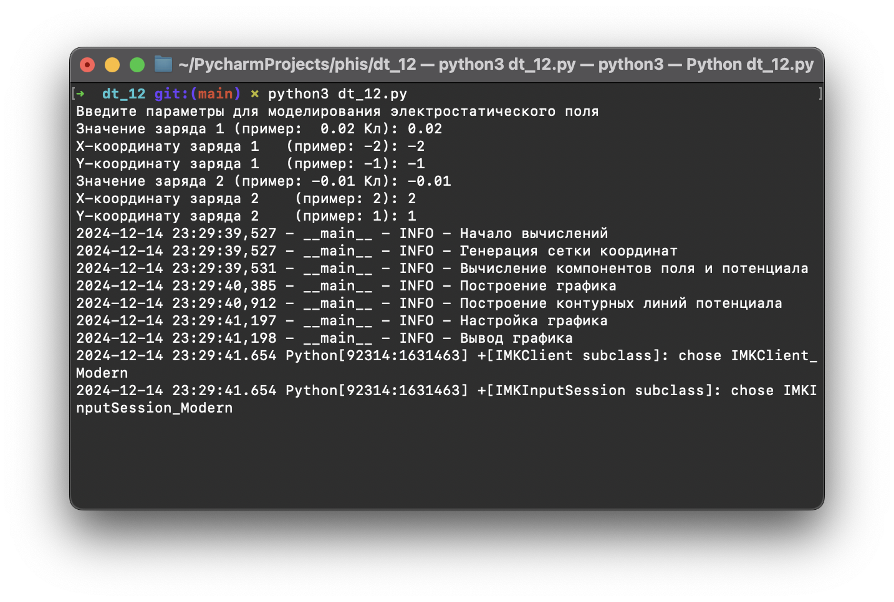
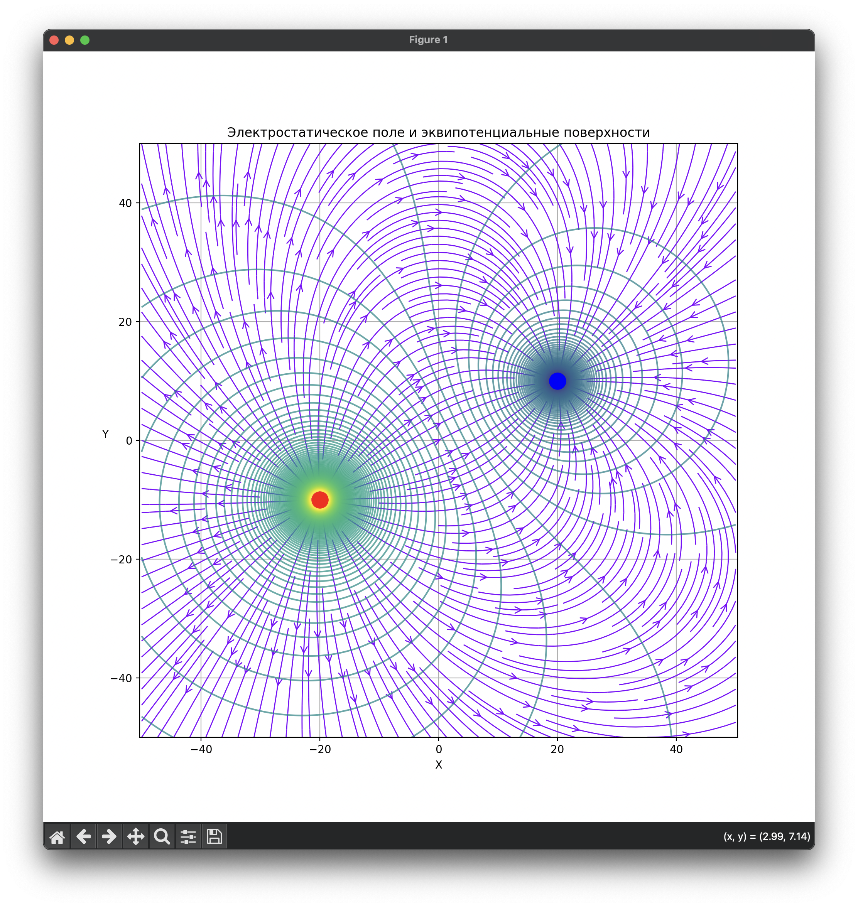

## Задание:

Усложнение модели с системой точечных зарядов (визуализация линий напряженности и эквипотенциальных поверхностей).
Добавить возможность помещения диполя в любую точку этого поля (при добавлении диполя учитывать направление и модуль
дипольного момента). В этой точке должны рассчитываться направления и модуль силы и моменты силы, действующих на диполь

## Пример:

