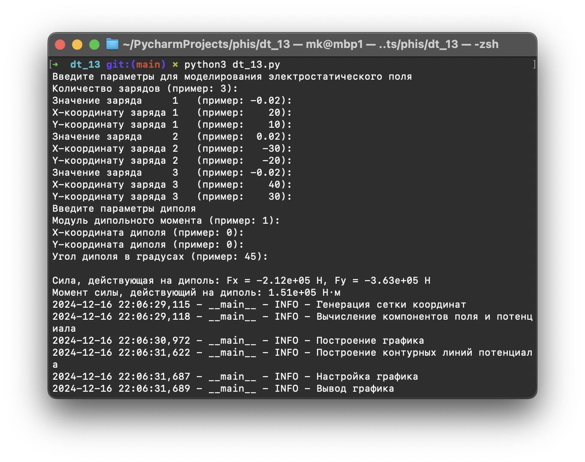

## Задание:

Визуализация эквипотенциальных поверхностей системы точечных зарядов. При выполнении предыдущего задания на визуализацию
линий напряженности рекомендуется совместить модели в одну.

## Пример:

